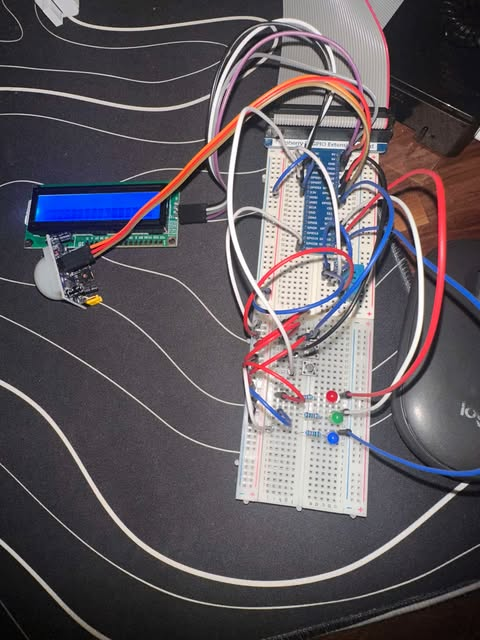

# Building Management System (BMS)

A Raspberry Pi-based Building Management System (BMS) for monitoring and controlling key building functions. This project integrates sensors, actuators, and an LCD display to provide real-time control and feedback for:

- **Ambient Lighting:** Detects room occupancy using a PIR sensor and controls lighting (GREEN LED) for energy efficiency.
- **HVAC Control:** Monitors temperature (DHT-11 sensor) and retrieves humidity from OpenWeatherMap API to calculate a "feels like" weather index. Controls heating (RED LED) and cooling (BLUE LED) with hysteresis to avoid rapid switching. User can set desired temperature via push buttons.
- **Fire Alarm:** Automatically triggers emergency procedures (opens doors/windows, turns off HVAC, flashes lights) if the weather index exceeds 95°F.
- **Security System:** Monitors door/window status with a push button, displays alerts, and disables HVAC when open.
- **Event Logging:** Maintains a timestamped log of all system events in `log.txt`.
- **LCD Display:** Continuously shows system status and event notifications.

## System Overview

**Safety Note:** Only use low voltage/current circuits and never work with mains electricity. Always check for potential shorts before powering the Raspberry Pi.
